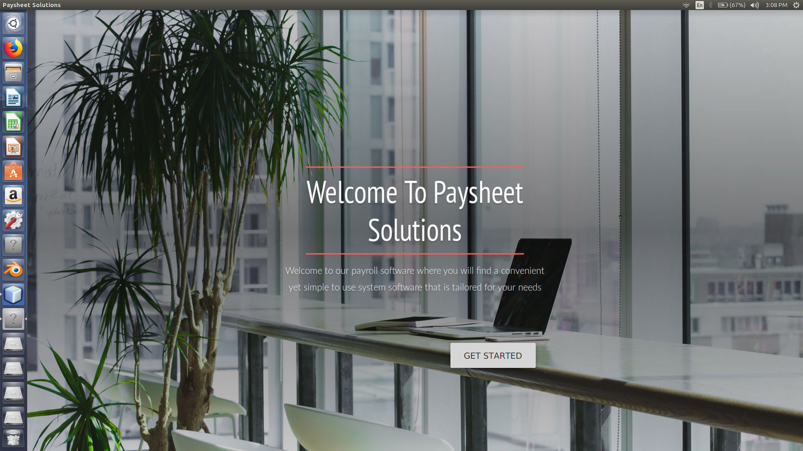

# payroll-management-software
A desktop application with a good looking GUI and with a administrative hierarchy with the obvious functionality of a payroll software.

Language Used:

    Java

Database Used:

    MySQL

Features

    An administrative hierarchy where there are four types of accounts-Administrator,Chairperson,Manager,Employeee.
    The Administrator has access to the entire database whereas the Chairperson can only view information of the people working in           lower management levels.Same goes for Manager and Employee and can only view and manage his account.
    Employee Information Management
    Basic Payroll functionalities( Salary, Bonus, Incetives, Deduction).
    Leave Management
    Pay-slip generation

Screenshot of the System

